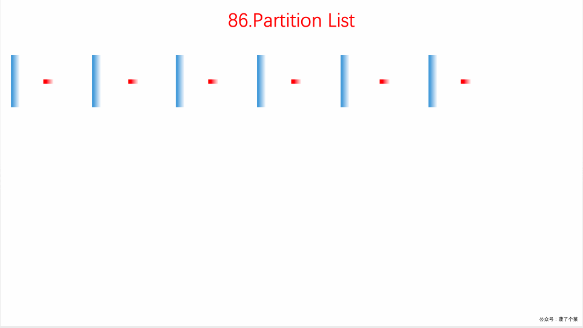

题目来源于 LeetCode 上第 86 号问题：分割链表。题目难度为 Easy，目前通过率为 47.8% 。

### 题目描述

给定一个链表和一个特定值 *x*，对链表进行分隔，使得所有小于 *x* 的节点都在大于或等于 *x* 的节点之前。

你应当保留两个分区中每个节点的初始相对位置。

**示例:**

```
输入: head = 1->4->3->2->5->2, x = 3
输出: 1->2->2->4->3->5
```

### 题目解析

这道题要求我们划分链表，把所有小于给定值的节点都移到前面，大于该值的节点顺序不变，相当于一个局部排序的问题。

- 设定两个虚拟节点，` beforeHead`用来保存小于于该值的链表，`afterHead `来保存大于等于该值的链表
- 遍历整个原始链表，将小于该值的放于`beforeHead `中，其余的放置在`afterHead `中
- 遍历结束后，将`afterHead `插入到`beforeHead `后面

### 动画描述



### 代码实现

```java
public ListNode partition(ListNode head, final int x) {
    // 构造两个链表，beforeHead小于x的节点，afterHead大于x的节点，最后将他们连在一起
    // 这里的技巧就是给两个链表都搞一个哑巴节点，也就是指向头结点的节点
    final ListNode beforeHead = new ListNode(-1);
    ListNode before = beforeHead;
    final ListNode afterHead = new ListNode(-1);
    ListNode after = afterHead;
    while (head != null) {
        if (head.val < x) {
            before.next = head;
            before = before.next;
        } else {
            after.next = head;
            after = after.next;
        }
        head = head.next;
    }
    after.next = null;
    before.next = afterHead.next;
    return beforeHead.next;
}
```
