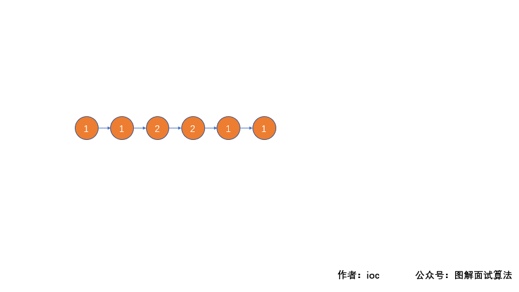

今天分享的题目来源于 LeetCode 上第 234号问题：回文链表。题目难度为 easy，目前通过率41.5%。

### 题目描述：

请判断一个链表是否为回文链表。

**示例 1:**

```
输入: 1->2
输出: false
```


**示例 2:**

```
输入: 1->2->2->1
输出: true
```

这道题还有进阶版本，我们先实现这个普通版本再看。


### 分析

首先，我们先遍历一遍链表，将链表中的每个值存入数组当中，然后我们判断数组中的元素是否满足回文数条件即可。
这里因为我们不知道链表的长度，我们先使用动态数组将值存起来，然后再存到固定大小的数组中。

#### 解法一动画描述


#### 代码实现

```java
public boolean isPalindrome(ListNode head) {
    List<Integer> list = new ArrayList<>();
    while (head != null) {
        list.add(head.val);
        head = head.next;
    }
    int[] arr = new int[list.toArray().length];
    int temp = 0;
    for (int a : list) {
        arr[temp++] = a;
    }
    temp = 0;
    for (int i = 0;i < arr.length/2;i++) {
        if (arr[i] == arr[arr.length-i-1]) {
            temp++;
        }
    }
    if(temp == arr.length/2) return true;
    return false;
}
```

**时间复杂度：O(n)  空间复杂度：O(n)**

### 进阶

**你能否用 O(n) 时间复杂度和 O(1) 空间复杂度解决此题？**

**思路分析：**我们先找到链表的中间结点，然后将中间结点后面的链表进行反转，反转之后再和前半部分链表进行比较，如果相同则表示该链表属于回文链表，返回true；否则，否则返回false

#### 解法二动画描述



#### 代码实现

```java
public boolean isPalindrome(final ListNode head) {
    if (head == null || head.next == null) {
        return true;
    }
    //找中点
    ListNode slow = head;
    ListNode fast = head;
    while (fast.next != null && fast.next.next != null) {
        slow = slow.next;
        fast = fast.next.next;
    }

    //链表分成两个
    //右边链表
    ListNode newHead = slow.next;
    // 将链表head切断作为待排序的左边链表
    slow.next = null;


    // 将右边链表翻转，然后判断两边链表是否相等
    return isEqual(head, reverseList(newHead));
}

private ListNode reverseList(ListNode head) {
    if (head == null || head.next == null) {
        return head;
    }
    final ListNode dummyHead = new ListNode(-1);
    while (head != null) {
        final ListNode next = head.next;
        head.next = dummyHead.next;
        dummyHead.next = head;
        head = next;
    }
    return dummyHead.next;
}

private boolean isEqual(ListNode l1, ListNode l2) {
    while (l1 != null && l2 != null) {
        if (l1.val != l2.val) {
            return false;
        }
        l1 = l1.next;
        l2 = l2.next;
    }
    return true;
}
```

**时间复杂度：O(n)  空间复杂度：O(1)**

**没错，可以看到上面的代码是完全能可以通过的，虽然我们完成了题目，但是我们改变了链表的结构，也就是说它现在不是它了；出题人应该是不希望我们破坏链表的，所以在我们完成判断之后，需要将链表恢复原样，也就是将后半部分链表反转之后接到前半部分链表的末尾。**